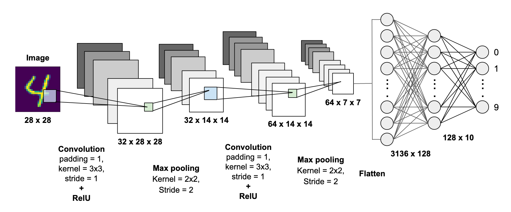

<h1 align="center">Handwritten digit Image classification with Keras CNN Using Deep Learning</h1>

## Project Overview
This project implements handwritten digit image classification using deep learning with Keras and the MNIST dataset, a standard benchmark for image classification tasks.The coding for this project was done using Google Colab.
 

• Dataset: MNIST dataset containing grayscale images of handwritten digits (0-9). 
• Objective: Accurately classify handwritten digit images using a deep learning approach with Convolutional Neural Networks (CNN). 

#### Key Features: 
1) Data Preprocessing: 
   • Loaded and preprocessed the MNIST dataset. 
   • Normalized grayscale images to enhance model performance. 
   
2) Deep Learning Model Development: 
   • Built a deep learning model using Convolutional Neural Networks (CNN) in Keras. 
   • Designed the CNN architecture with multiple convolutional and pooling layers to capture intricate patterns in handwritten digits. 
   • Applied dropout and batch normalization to prevent overfitting and improve generalization. 

3) Model Training and Evaluation: 
   • Trained the CNN model on the MNIST dataset. 
   • Achieved high accuracy in digit classification, demonstrating the effectiveness of deep learning for image classification tasks. 
   • Built a deep learning model using Convolutional Neural Networks (CNN) in Keras. 

#### Repository Contents 
• notebooks: Google Colab notebooks with detailed steps for data preprocessing, deep learning model development, training, and evaluation. 
• models: Saved model files for reuse and inference. 
• reports: Performance metrics and evaluation reports. 

